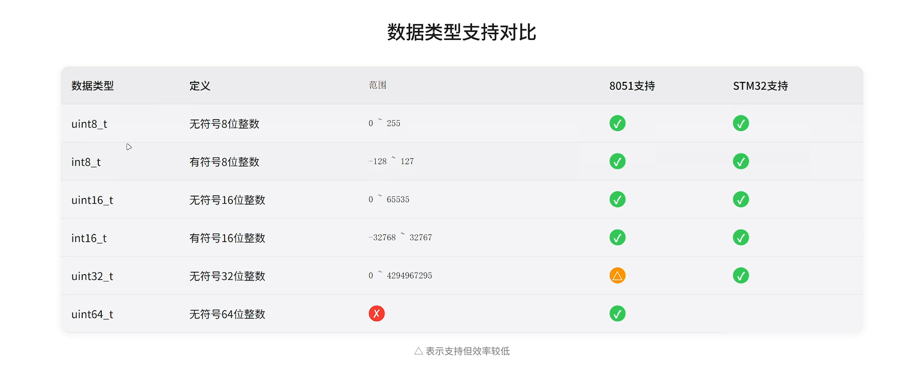

# 第一讲蓝桥杯过渡

## 嵌入式开发中命名规范的重要性

命名规范看起来像小问题，但在嵌入式开发里其实很重要。因为单片机程序里变量多、函数多、外设也多，如果名字起得乱，后面自己回头看也容易看糊涂。

### 可读性

名字起得清楚，代码一眼就能看出大概意思。

比如：

```c
int a;
int led_state;
```

`a` 很难看出用途，但 `led_state` 一看就知道表示 LED 的状态。

所以命名规范最直接的作用，就是让代码更容易读。

### 可维护性

嵌入式代码不是写完就结束，后面还要调试、修改、加功能。

如果变量名、函数名起得不清楚，过几天再回头看代码时，自己都要重新猜一遍含义，改起来就容易出错。

小例子：

- `temp` 可能是温度，也可能只是临时变量
- `motor_speed` 就很明确，表示电机速度

名字越清楚，后面维护起来越轻松。

### 团队协作

如果一个项目有多个人一起做，统一命名风格会省很多沟通时间。

比如大家提前约定：

- 变量统一用蛇形命名
- 宏定义统一全大写
- 函数名统一一个风格

这样别人接手代码时，不用先适应每个人的个人习惯，阅读起来会更顺。

## 常用的命名法

### 蛇形命名法

蛇形命名法就是单词之间用下划线连接。

例如：

```c
led_state
uart_rx_buffer
timer_count
```

这种写法在 C 语言和嵌入式开发中很常见，因为结构清楚，一眼就能分出是几个单词。

### 驼峰命名法

驼峰命名法的特点是：第一个单词首字母小写，后面每个单词首字母大写。

例如：

```c
ledState
timerCount
uartReceiveFlag
```

这种写法在一些库函数、上层代码里比较常见。

### 帕斯卡命名法

帕斯卡命名法和驼峰命名法很像，不同点在于每个单词首字母都大写。

例如：

```c
LedState
TimerCount
SystemInit
```

这种写法常用于类型名、结构体名、模块名这些场景。

### 匈牙利命名法

匈牙利命名法会在变量名前加前缀，用来提示变量类型或用途。

例如：

```c
iCount
chData
pBuffer
```

这里：

- `i` 可能表示 `int`
- `ch` 可能表示 `char`
- `p` 可能表示指针

这种命名法以前比较常见，现在了解即可，不建议为了加前缀把名字写得太复杂。

### 全大写写法（宏定义）

全大写一般用于宏定义、常量、条件编译标记。

例如：

```c
#define LED_ON  1
#define LED_OFF 0
#define BUFFER_SIZE 64
```

这样做的好处是，看到名字时能马上意识到它不是普通变量。

## 嵌入式开发中命名注意事项

### 避免与系统保留字冲突

不要把变量名起成 C 语言关键字，或者系统里已经有特殊含义的名字。

例如下面这些就不能直接拿来当变量名：

```c
int int;
int char;
int switch;
```

因为 `int`、`char`、`switch` 本身就是关键字。

简单理解就是：系统已经占用的词，自己不要再拿来用。

### 长度限制

变量名不能太短，也不要长得太夸张。

例如：

- `a` 太短，看不出意思
- `this_is_the_value_used_for_the_second_led_blink_count` 太长，读起来很累

比较合适的写法应该像这样：

```c
led_count
adc_value
key_scan_flag
```

也就是“够清楚，但不过度啰嗦”。

### 语义清晰

命名最重要的一点就是要有实际含义。

比如：

```c
data1
data2
value
```

这种名字虽然能用，但提供的信息太少。

如果改成：

```c
adc_value
motor_speed
key_press_flag
```

意思就清楚很多。

名字最好让人一看就知道“它是干什么的”。

## 单片机架构对比

### 8051架构

8051 是比较经典的 8 位单片机架构，很多入门教学都会先从它开始。

它的特点是：

- 结构相对简单
- 资源比较少
- 更适合理解单片机最基础的概念

比如学习 IO 口、定时器、中断这些基础内容时，8051 很适合拿来入门。

可以把它理解成“单片机入门练基础功”的代表。

### STM32架构

STM32 一般是基于 ARM Cortex-M 内核的 32 位单片机，性能比 8051 强很多。

它的特点是：

- 主频更高
- 外设更多
- 存储资源更大
- 工程开发更常见

比如串口、ADC、PWM、定时器、DMA 等，STM32 往往都能提供更完整的支持。

可以把它理解成“更接近实际项目开发”的主流平台。



这张图可以当作架构示意图来参考。

简单对比如下：

| 对比项 | 8051 | STM32 |
| --- | --- | --- |
| 位数 | 8位 | 32位 |
| 性能 | 较低 | 较高 |
| 外设资源 | 相对较少 | 相对较多 |
| 学习定位 | 基础入门 | 工程开发 |
| 开发复杂度 | 较低 | 较高 |

一句通俗的话总结：

- 8051 更像“先学会走”
- STM32 更像“开始真正跑起来”

## 嵌入式开发的三种方式

嵌入式开发常见的三种方式，可以理解为“离底层硬件有多近”的区别。

### 寄存器开发

寄存器开发就是直接操作硬件寄存器。

例如：

```c
GPIOA->ODR |= (1 << 5);
```

这类写法直接控制寄存器，优点是：

- 速度快
- 控制细
- 更能理解底层原理

缺点是：

- 上手难
- 容易写错
- 可读性一般

适合打基础，理解单片机到底是怎么工作的。

### 标准库开发

标准库开发是在寄存器开发基础上做了一层封装。

它不像直接操作寄存器那样底层，但也没有 HAL 那样封装得那么高。

优点是：

- 比寄存器开发更容易写
- 还能比较清楚地看到外设配置过程

缺点是：

- 代码量还是不算少
- 不同芯片、不同库之间迁移时要重新适应

它比较适合“已经懂一点底层，想提高开发效率”的阶段。

### HAL库开发

HAL 库开发是 ST 官方提供的高层封装方式，实际项目里很常见。

比如配置 GPIO、串口、定时器时，很多内容都已经帮你封装好了。

硬件抽象层开发，简单来说就是：

**不直接去操作底层寄存器，而是通过封装好的函数来控制硬件。**

比如点亮一个 LED：

寄存器开发：

```c
GPIOA->ODR |= (1 << 5);
```

HAL 库开发：

```c
HAL_GPIO_WritePin(GPIOA, GPIO_PIN_5, GPIO_PIN_SET);
```

可以简单理解为：

- 寄存器开发是自己直接拧螺丝
- HAL 开发是别人先把工具准备好了，你按说明去用

优点是：

- 开发效率高
- 代码结构相对统一
- 配合 CubeMX 使用更方便

缺点是：

- 封装较深
- 初学者有时会“会用但不懂底层”

所以学习时不要只停留在“能调函数”，最好知道函数背后大概做了什么。

很多人更喜欢用 HAL 库，而不是标准库，主要原因有下面几点：

- HAL 库封装更多，开发速度更快
- 和 CubeMX 配合更方便，适合现在常见的开发流程
- 官方资料、例程、模板更多，查资料更方便
- 不同 STM32 芯片之间代码风格更统一，迁移更顺手

有时候开发时还会去参考“相似芯片”的 HAL 工程。

这是因为很多 STM32 芯片虽然型号不同，但 GPIO、串口、定时器、中断这些外设的开发思路很接近，所以可以先借用一个相似工程的框架，再改成自己的芯片配置。

这件事为什么可行？

因为 HAL 库的接口风格比较统一。

例如串口发送，很多芯片都会写成类似下面这种形式：

```c
HAL_UART_Transmit(&huart1, buf, len, 100);
```

所以找相似芯片时，本质上不是照抄全部代码，而是参考它的开发套路。

不过要注意，“相似”不等于“完全一样”，下面这些地方不能直接照搬：

- 时钟配置
- 引脚复用
- 外设编号
- 中断名称
- ADC 通道
- 定时器功能
- Flash 和 RAM 大小

一句话记住：

**思路可以借，配置不能乱抄。**

三种方式可以这样简单理解：

| 开发方式 | 通俗理解 | 特点 |
| --- | --- | --- |
| 寄存器开发 | 直接拧螺丝 | 最底层，最灵活 |
| 标准库开发 | 用工具装配 | 比较平衡 |
| HAL库开发 | 按说明搭积木 | 上手快，效率高 |

学习建议：

- 入门时要知道寄存器是什么
- 进阶时要能看懂标准库思路
- 做项目时要会用 HAL 库提高效率
