# 第三讲工程模板建立

这一讲主要学习 STM32 基础工程模板怎么建立。重点是先把工程里最常用、最基础的配置固定下来，包括时钟配置、SYS 调试接口配置、Project Manager 工程生成设置，以及 ST-Link 下载连接。把这些基础步骤走顺，后面无论是继续写裸机程序，还是接任务调度器、RTOS，都会更方便。

课件示例主要基于 `STM32F429ZGTx`，当前西门子杯备赛主控是 `GD32F470VET6`。两者在工程建立、时钟配置、调试下载这些基础流程上思路接近，学习时可以先跟着课件走，再结合当前芯片做对应调整。

## 裸机开发和调度器开发

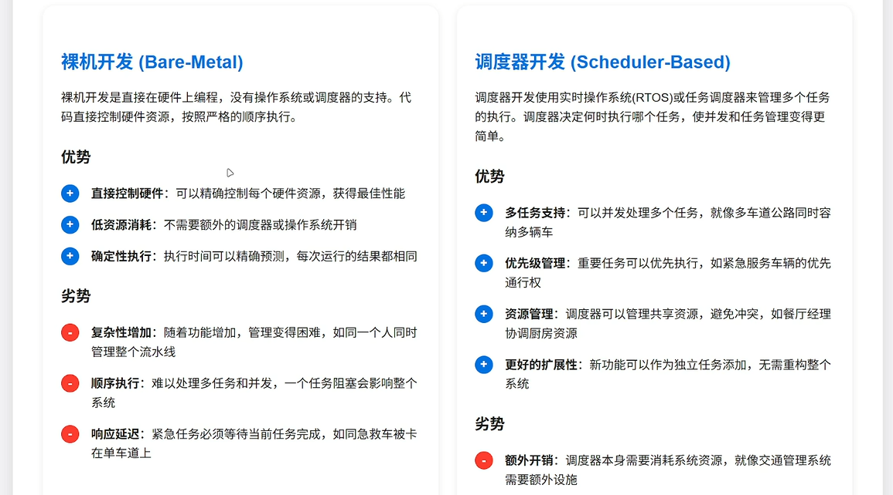

### 裸机开发（Bare-Metal）

裸机开发就是直接在硬件上编程，没有操作系统或调度器的参与。

特点：

- 直接控制硬件资源
- 系统开销小
- 执行顺序固定
- 适合简单任务

问题：

- 功能一多，代码容易乱
- 多任务处理困难
- 一个任务阻塞，可能影响整个系统

### 调度器开发（Scheduler-Based）

调度器开发是把不同功能拆成多个任务，再按时间或规则安排执行。

特点：

- 适合多任务开发
- 任务管理更清晰
- 方便扩展
- 更适合后续 RTOS 学习

一句话理解：

- 裸机开发更直接
- 调度器开发更适合复杂项目

## 时钟配置

### 为什么要配时钟

时钟决定了芯片运行速度，也决定了很多外设能不能正常工作。

时钟配置主要影响：

- 程序运行速度
- 外设驱动
- 系统稳定性
- 功耗控制

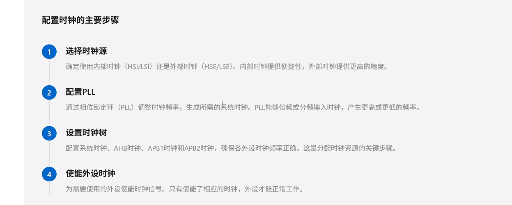

### 配置时钟的主要步骤

#### 选择时钟源

常见时钟源有：

- `HSI`：内部高速时钟
- `HSE`：外部高速时钟
- `LSI`：内部低速时钟
- `LSE`：外部低速时钟

一般理解：

- `HSE` 常用于主系统时钟
- `LSE` 常用于 `RTC`

这里还要特别注意：

- 外部晶振频率不是固定值，不同开发板可能不一样
- 配时钟前一定要先看原理图或板卡说明，确认板子实际用的是多少 MHz 的外部晶振

一句话记住：

**`HSE` 频率不能想当然，必须先确认硬件实际参数。**

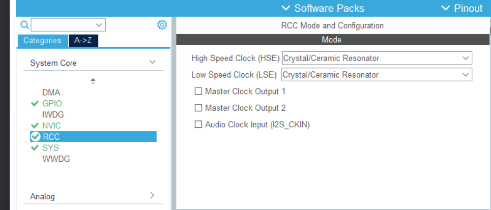

#### 配置 PLL

`PLL` 的作用是对输入时钟进行倍频或分频，得到目标系统主频。

简单说：

- 先选输入时钟
- 再通过 `PLL` 调整频率
- 最后得到系统需要的时钟

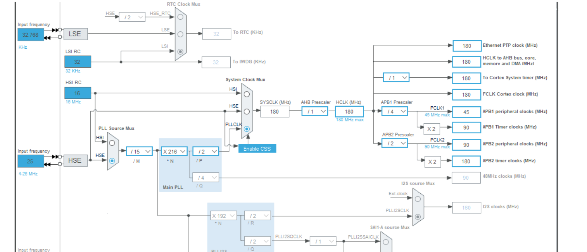

#### 配置时钟树

时钟树里常见几个时钟：

- `SYSCLK`
- `HCLK`
- `PCLK1`
- `PCLK2`

配时钟树时要注意：

- 各总线频率不能超范围
- 外设时钟要和芯片规格匹配

#### 使能外设时钟

外设不是初始化了就能用，还必须有对应时钟。

例如：

- GPIO 需要 GPIO 时钟
- 串口需要 USART 时钟
- 定时器需要 TIM 时钟

一句话记住：

**外设要工作，先保证时钟正确。**

## SYS 配置

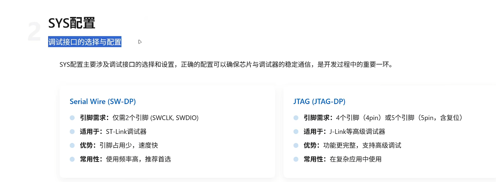

### 调试接口配置

在 `System Core -> SYS` 里，开发阶段通常把：

```text
Debug = Serial Wire
```

也就是使用 `SWD` 调试方式。

### SWD 和 JTAG

#### SWD

特点：

- 只用较少引脚
- 接线简单
- STM32 开发中最常用

常见信号：

- `SWDIO`
- `SWCLK`

#### JTAG

特点：

- 引脚更多
- 功能更完整
- 一般复杂调试时才会考虑

一句话记住：

**平时建工程，优先选 `SWD`。**

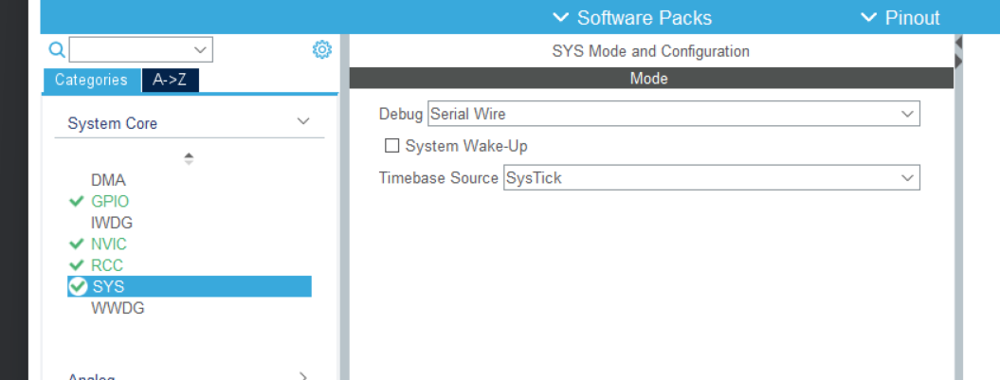

## Project Manager 工程设置

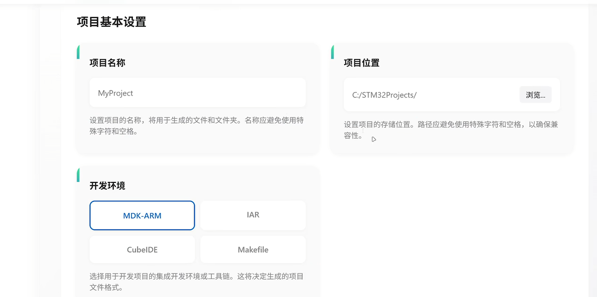

### 项目基本信息

主要包括：

- 项目名称
- 项目保存位置
- 工具链 / IDE 选择

例如常见选择：

- `MDK-ARM`
- `IAR`
- `CubeIDE`

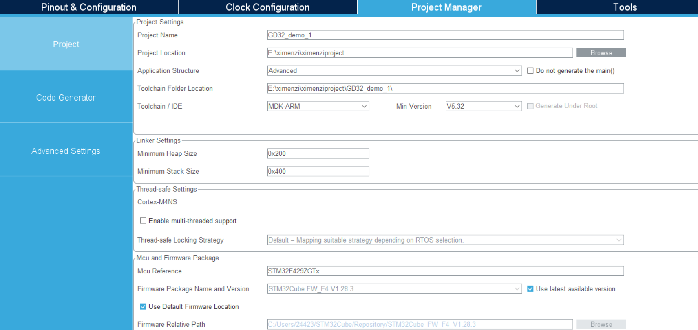

### Code Generator 常见设置

常用选项有：

- `Copy only the necessary library files`
- `Generate peripheral initialization as a pair of '.c/.h' files per peripheral`
- `Keep User Code when re-generating`

这些选项的作用可以简单理解为：

- 只拷贝必要库文件，让工程更精简
- 每个外设单独生成 `.c/.h`，结构更清楚
- 重新生成代码时保留用户代码，避免内容丢失

一句话记住：

**建模板时，工程结构要清晰，用户代码要能保留。**


## 下载器与接线

### ST-Link 常见连接方式

STM32 下载最常见的是 `ST-Link + SWD`。

至少要接：

- `SWDIO`
- `SWCLK`
- `GND`

建议再接：

- `VCC`


### 为什么 GND 必须接

因为下载器和目标板必须共地，否则通信可能不正常。

### VCC 为什么建议接

`VCC` 常作为目标板参考电平，接上以后更稳，也方便下载器识别目标板电压。

一句话记住：

**`SWDIO`、`SWCLK`、`GND` 是基本连接，`VCC` 建议也接。**

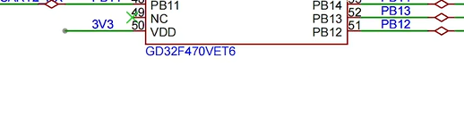

## 下载失败常见原因

如果出现下载器连接失败，可以优先排查下面几项：

- USB 线或驱动有问题
- `ST-Link` 没识别到
- `SWDIO`、`SWCLK`、`GND` 接错
- 板子供电异常
- `SYS` 里没有正确配置 `Serial Wire`

有些情况下还可以尝试：

- `Connect under Reset`

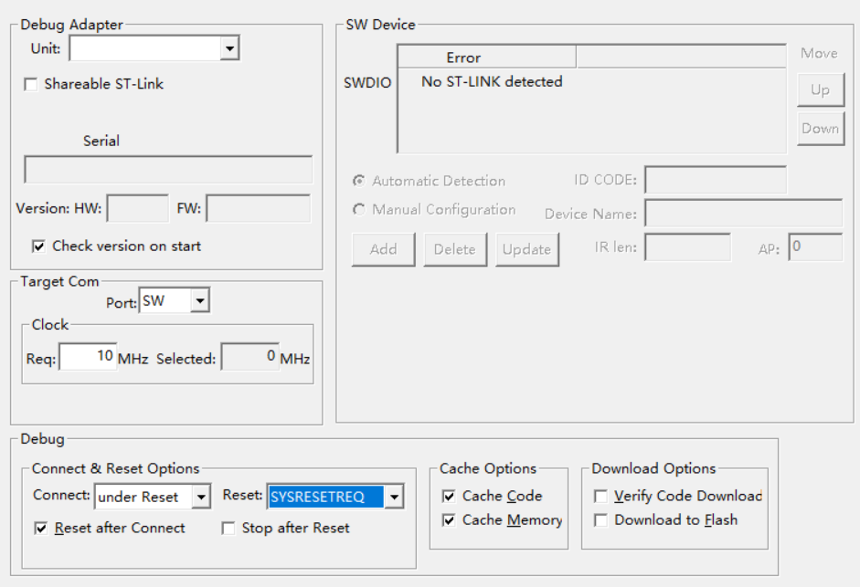

### 烧录报错后常见处理

如果后续在烧录时出现连接失败、找不到下载器，或者程序一直下载不进去，可以按下面这个顺序去检查和设置。

#### 先检查 CubeMX 里的 SYS 配置

先回到：

`System Core -> SYS`

确认：

```text
Debug = Serial Wire
```

如果这里没有选 `Serial Wire`，后面的 `SWD` 下载和调试就可能出问题。

#### 再检查下载器接线

重点看这 4 根线：

- `SWDIO`
- `SWCLK`
- `GND`
- `VCC`

其中：

- `GND` 必须接
- `VCC` 强烈建议接

如果 `GND` 没接好，或者 `SWDIO`、`SWCLK` 接反，常见现象就是连不上板子、识别不到芯片、下载失败。

#### 在 Keil 里常用的处理方法

如果已经确定接线没问题，但还是烧录报错，可以在 Keil 的下载设置里这样处理：

1. 打开 `Options for Target`
2. 进入 `Debug`
3. 点击 `Settings`
4. 确认 `Port` 选的是 `SW`
5. 如果仍然连不上，把 `Connect` 改成 `under Reset`
6. `Reset` 可以选 `SYSRESETREQ`

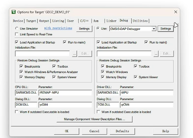

上面这一步主要是先进入调试器设置界面，后面真正和烧录、连接相关的选项都在这里继续点进去。

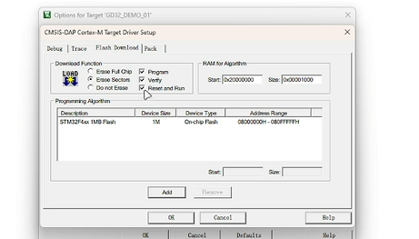

在 `Flash Download` 这一页里，通常要确认：

- 已经选中了对应芯片的 Flash Algorithm
- 勾上 `Reset and Run`

如果这里芯片算法没选对，也可能导致烧录异常。

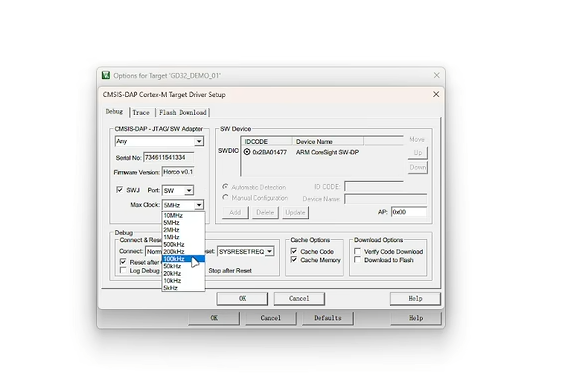

这张图里重点看几个地方：

- `Port` 选 `SW`
- `Max Clock` 不要一开始设太高，连不上时可以先降一点
- `Connect` 选 `under Reset`
- `Reset` 选 `SYSRESETREQ`

这一步的作用是：

- 让下载器在芯片复位时建立连接
- 适合程序跑飞、普通连接方式连不上的情况

#### 如果界面提示 `No ST-LINK detected`

这个提示一般说明电脑这边就还没有正常识别下载器，这时候先不要急着改工程，优先检查下面几项：

- `ST-Link` 有没有插好
- USB 线是不是只能供电不能传数据
- 驱动有没有装好
- 电脑有没有识别到下载器
- 下载器和目标板有没有共地

简单理解：

- `No ST-LINK detected` 更像是“电脑没看到下载器”
- `连上下载器但识别不到芯片` 更像是“接线或芯片侧配置有问题”

#### 一个实用排查顺序

如果后面再遇到烧录报错，可以按这个顺序排查：

1. 先看 `SYS -> Debug` 是否为 `Serial Wire`
2. 再看 `SWDIO`、`SWCLK`、`GND`、`VCC` 接线
3. 再看电脑有没有识别到 `ST-Link`
4. 最后去 Keil 里把 `Port` 设为 `SW`，必要时把 `Connect` 改成 `under Reset`

一句话记住：

**烧录报错时，不要一上来就怀疑程序，先查 `SYS` 配置、接线、下载器识别，再去改下载设置。**

## 本讲小结

这一讲最核心的内容有 4 个：

- 时钟配置决定系统能不能稳定运行
- `SYS` 里通常选 `Serial Wire`
- `Project Manager` 里的工程生成选项要提前固定好
- `ST-Link` 下载时先检查接线、供电和调试接口配置

一句话总结：

**第三讲的目标，不是单纯把工程建出来，而是先建立一个后面能一直复用的 STM32 工程模板。**
