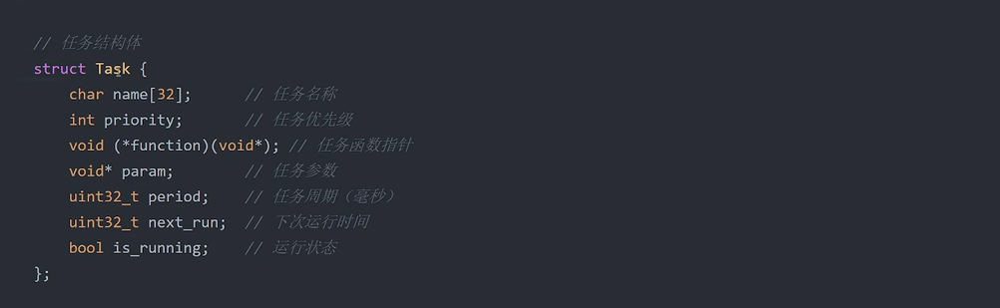
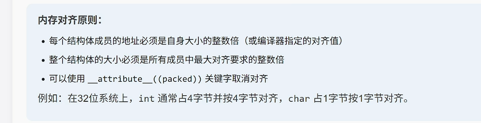

# 第二讲任务调度器

这一讲主要学习任务调度器的基本思路：为什么裸机开发里不能总用 `while(1) + HAL_Delay()`，为什么要用非阻塞方式按时间管理任务；同时结合结构体理解一个任务需要记录哪些信息，学会看懂调度器主循环是怎么判断任务到期并执行的。另外，这一讲还重点理解了为什么时间判断更推荐用“时间差”写法，以及 `last_run` 放在任务执行前后更新会带来什么区别。

## 任务调度器

任务调度器可以理解成单片机里的“时间管理工具”。

在裸机开发里，如果所有功能都堆在 `while(1)` 里，再配合 `HAL_Delay()` 去控制节奏，就很容易出现一个任务阻塞、其他任务都跟着等的情况。

例如：

```c
while (1)
{
    Led_Proc();
    HAL_Delay(1);

    Key_Proc();
    HAL_Delay(10);

    Sensor_Proc();
    HAL_Delay(100);

    Comm_Proc();
    HAL_Delay(50);
}
```

这种写法的问题是：

- 某个任务一旦等待时间长，后面的任务也会被拖慢
- 程序看起来在循环，实际上很多时间都卡在延时里
- 功能一多以后，整体响应会越来越差

所以这时候就需要调度器来按时间管理任务，让不同任务在各自的周期内执行，这就是一种典型的非阻塞设计。

可以简单理解成：

- 阻塞式写法：一个任务没做完，别的任务先等着
- 非阻塞式写法：每个任务到时间就执行一下，不互相拖死

## C语言结构体基础

要做任务调度器，不能只知道“任务要做什么”，还要知道“多久做一次”和“上次什么时候做过”。

把这些信息打包在一起，最方便的方式就是结构体。

结构体定义






结构体变量的声明与初始化一般有两种常见方式，可以结合上面的图一起看。

访问结构体成员

- `.` 用来访问结构体变量成员
- `->` 用来访问结构体指针成员，后面封装函数时会更常见

这里可以先记一个等价关系：

```c
p->member
```

等价于：

```c
(*p).member
```

也就是说，`p` 先是一个指针，`*p` 表示“指针指向的那个结构体”，然后再用 `.` 去访问这个结构体里的成员。

为什么后面封装函数时 `->` 更常见？

- 因为很多函数不会把整个结构体复制一份传进去
- 更常见的做法是把结构体地址传给函数
- 这样效率更高，也方便直接修改原来的结构体内容

例如：

```c
void task_reset(scheduler_task_t *task)
{
    task->last_run = 0;
}
```

这里 `task` 是一个结构体指针，所以访问成员时要写成 `task->last_run`。

一句话记住：

- 结构体变量，用 `.`
- 结构体指针，用 `->`

```c
typedef struct {
    void (*task_func)(void);  // 任务函数指针
    uint32_t rate_ms;         // 执行周期（毫秒）
    uint32_t last_run;        // 上次执行时间
} scheduler_task_t;
```

这里定义了一个任务结构体，每个任务都包含 3 个关键信息：

- `task_func`：这个任务具体要执行哪个函数
- `rate_ms`：这个任务隔多少毫秒执行一次
- `last_run`：这个任务上一次执行是在什么时间

也就是说，一个任务不只是“做什么”，还要知道“多久做一次”和“上次做到哪了”。

```c
// 全局变量，用于存储任务数量
uint8_t task_num;

// 静态任务数组，每个任务包含任务函数、执行周期（毫秒）和上次运行时间（毫秒）
static scheduler_task_t scheduler_task[] =
{
    {Led_Proc, 1, 0},    // LED控制任务：周期1ms
    {Key_Proc, 10, 0},   // 按键扫描任务：周期10ms
    {Sensor_Proc, 100, 0}, // 传感器读取任务：周期100ms
    {Comm_Proc, 50, 0}   // 通信处理任务：周期50ms
};
```

把多个任务结构体放进一个数组里，本质上就是做了一张任务表。

后面的调度器要做的事其实很简单：

- 挨个查看任务表
- 判断哪个任务到时间了
- 到时间就执行

```c
/**
 * @brief 调度器初始化函数
 * 计算任务数组的元素个数，并将结果存储在 task_num 中
 */
void scheduler_init(void)
{
    // 计算任务数组的元素个数，并将结果存储在 task_num 中
    task_num = sizeof(scheduler_task) / sizeof(scheduler_task_t);
}
```

```c
/**
 * @brief 调度器运行函数
 * 遍历任务数组，检查是否有任务需要执行。如果当前时间已经超过任务的执行周期，则执行该任务并更新上次运行时间
 */
void scheduler_run(void)
{
    // 遍历任务数组中的所有任务
    for (uint8_t i = 0; i < task_num; i++)
    {
        // 获取当前的系统时间（毫秒）
        uint32_t now_time = HAL_GetTick();

        // 检查距离上次执行是否已经达到任务周期
        if ((now_time - scheduler_task[i].last_run) >= scheduler_task[i].rate_ms)
        {
            // 更新任务的上次运行时间为当前时间
            scheduler_task[i].last_run = now_time;

            // 执行任务函数
            scheduler_task[i].task_func();
        }
    }
}
```

这里还有一个容易混淆的点：`last_run` 放在任务执行前更新，还是放在任务执行后更新，会影响调度节奏。

当前写法是：

```c
scheduler_task[i].last_run = now_time;
scheduler_task[i].task_func();
```

这表示任务一开始执行，就把这次运行时间记下来。这样做的特点是：

- 周期是按“任务开始时刻”来算
- 任务本身执行花掉的时间，不会额外叠加到下一次周期里

如果只是把顺序调换成：

```c
scheduler_task[i].task_func();
scheduler_task[i].last_run = now_time;
```

因为这里记录的仍然是前面已经取到的 `now_time`，所以结果基本没有本质变化。

但如果写成下面这样：

```c
scheduler_task[i].task_func();
scheduler_task[i].last_run = HAL_GetTick();
```

那含义就变了，这表示任务执行完以后，才把“当前时刻”记成上次执行时间。这样会带来两个结果：

- 周期会更接近“从任务结束后开始算”
- 任务本身执行的耗时，会被加进总周期里

例如一个任务周期是 `10ms`，但任务本身执行花了 `3ms`：

- 先记录时间再执行：下一次大约还是按 `10ms` 周期到来
- 执行完再重新取时间：下一次可能变成接近 `13ms` 才到

所以对这种简单轮询调度器来说，通常更常见的是“先记录时间，再执行任务”。

```c
uint32_t HAL_GetTick(void);
```

`HAL_GetTick()` 是 HAL 库提供的系统时基函数，通常返回系统从启动到现在经过了多少毫秒。

## 为什么推荐用时间差判断

在任务调度器里，判断任务是否到期时，更推荐写成：

```c
if ((now_time - last_run) >= rate_ms)
```

而不是直接写成：

```c
if (now_time >= last_run + rate_ms)
```

原因是 `HAL_GetTick()` 返回值通常是 `uint32_t`，系统运行足够久以后，计数值会从最大值重新回到 `0`，这就是时间溢出。

### 直接比较为什么容易出问题

如果直接判断：

```c
if (now_time >= last_run + rate_ms)
```

看起来像是在判断“当前时间有没有到目标时间”，但这里有一个问题：

- `last_run + rate_ms` 这一步本身就可能先溢出
- 一旦目标时间回绕成很小的数，就可能提前误判任务到期

也就是说，任务实际上还没到时间，程序却可能已经执行了。

### 时间差判断为什么更稳

时间差写法判断的是“从上次运行到现在，已经过去了多少时间”。

```c
if ((now_time - last_run) >= rate_ms)
```

这种写法的核心不是比较绝对时间点，而是比较经过时间。

### 为什么无符号减法不会算错

前提是 `now_time` 和 `last_run` 都是 `uint32_t`。

C 语言里，无符号整数运算是有明确定义的：按 `2^32` 回绕计算，不是报错，也不是出现错误码。

例如：

```c
last_run = 0xFFFFFFF0;
now_time = 0x00000014;
```

这时直接看数值，好像是“当前时间比上次时间还小”，但因为它们是无符号数，所以做减法时会按回绕后的结果来算：

```c
now_time - last_run
= 0x00000014 - 0xFFFFFFF0
= 0x00000024
= 36
```

这个 `36` 不是算错了，而是表示从 `last_run` 到 `now_time` 实际已经过了 `36ms`。

可以把它理解成：计数器先从 `0xFFFFFFF0` 走到最大值，再从 `0` 重新开始走到 `0x00000014`，总步数正好是 `36`。

### 一句话记住

- `now_time >= last_run + rate_ms` 比较的是目标时间点，溢出后容易误判
- `(now_time - last_run) >= rate_ms` 比较的是已经过去了多久，更适合做调度器和超时判断

## 进阶应用

### 时间溢出处理

系统运行足够久以后，`HAL_GetTick()` 会发生回绕，所以时间判断更推荐使用时间差方式。

### 任务执行时间监控

如果某个任务本身执行太久，就会影响其他任务的实时性，所以后面还可以记录任务执行前后的时间差，检查任务有没有超时。

### 调度器扩展

当任务越来越多时，简单轮询可能就不够用了，后面还可以继续引出状态机、优先级调度，甚至 RTOS。
